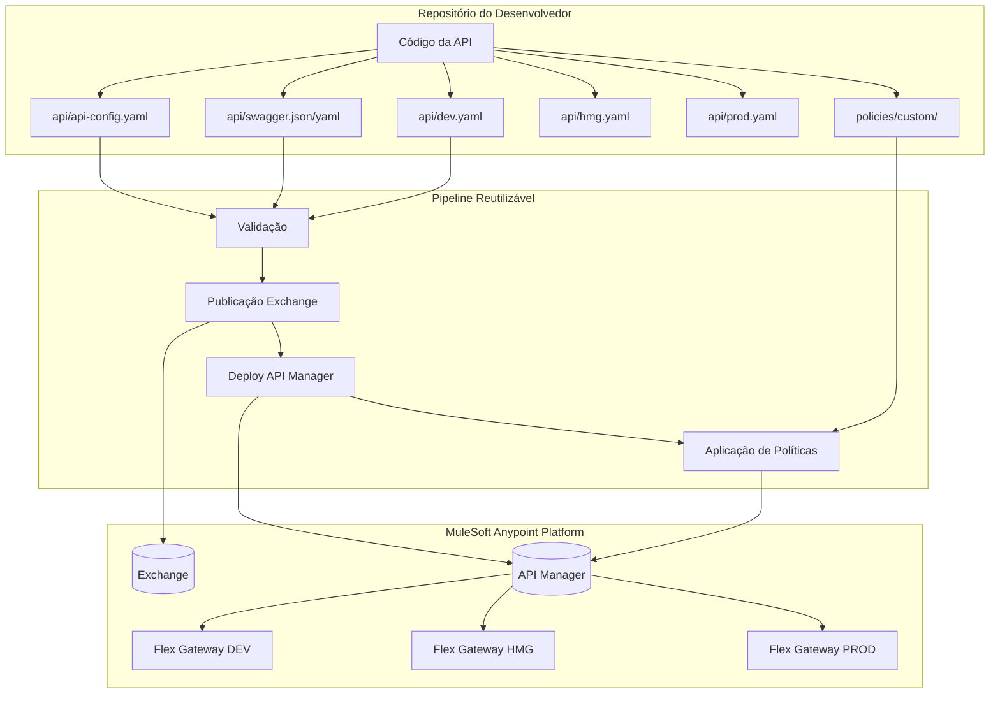
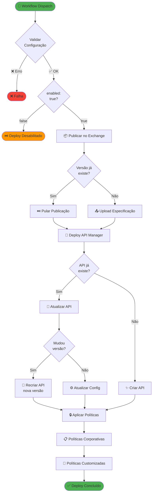
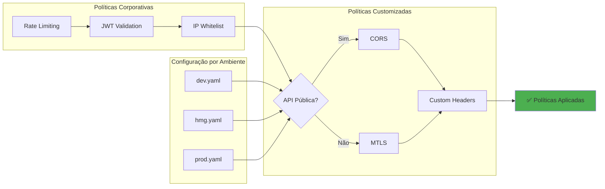
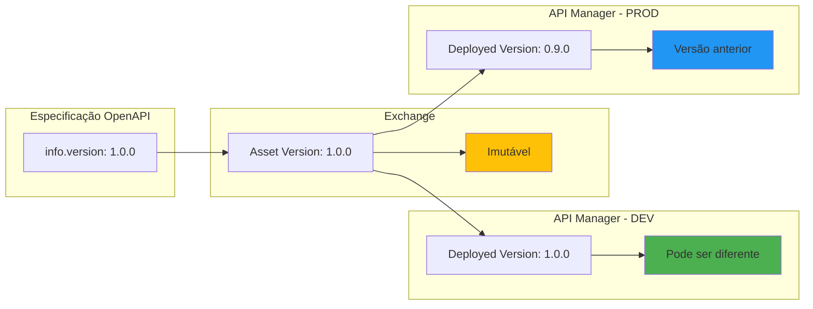

# 🚀 MuleSoft API Flex Gateway - Reusable Workflows

Pipeline reutilizável para deploy automatizado de APIs no MuleSoft Flex Gateway, incluindo publicação no Anypoint Exchange, deploy no API Manager e aplicação de políticas de segurança.

## 📋 Índice

- [Visão Geral](#-visão-geral)
- [Arquitetura](#-arquitetura)
- [Fluxo da Pipeline](#-fluxo-da-pipeline)
- [Estrutura do Repositório Consumidor](#-estrutura-do-repositório-consumidor)
- [Configuração](#-configuração)
- [Como Usar](#-como-usar)
- [Exemplos](#-exemplos)
- [Troubleshooting](#-troubleshooting)

---

## 🎯 Visão Geral

Esta pipeline automatiza o processo completo de deploy de APIs no MuleSoft, incluindo:

- ✅ **Validação de configuração** da API
- 📦 **Publicação no Anypoint Exchange** (especificação OpenAPI)
- 🚀 **Deploy no API Manager** e Flex Gateway
- 🔒 **Aplicação de políticas de segurança** (corporativas + customizadas)
- 📊 **Configuração de alertas** por ambiente

**Por que usar?**
- Separa build de API do build de aplicação
- Você controla quando publicar no Exchange
- Políticas corporativas aplicadas automaticamente
- Configuração independente por ambiente
- Credenciais seguras via GitHub Secrets

---

## 🏗️ Arquitetura



---

## 🔄 Fluxo da Pipeline

### Fluxo Completo de Deploy



### Fluxo de Decisão de Políticas



---

## 📁 Estrutura do Repositório Consumidor

Estrutura mínima necessária:

```
seu-repositorio-api/
├── .github/
│   └── workflows/
│       └── deploy-api.yml          # Workflow que chama a pipeline reutilizável
├── api/
│   ├── api-config.yaml              # Configuração global da API
│   ├── dev.yaml                     # Configuração + políticas + SLAs do ambiente DEV
│   ├── hmg.yaml                     # Configuração + políticas + SLAs do ambiente HMG
│   ├── prod.yaml                    # Configuração + políticas + SLAs do ambiente PROD
│   └── swagger.json                 # Especificação OpenAPI
└── src/                             # Código da sua aplicação
```

**Nota:** As políticas e SLAs são definidos dentro de cada arquivo de ambiente (dev.yaml, hmg.yaml, prod.yaml). 

### 🔄 Ambientes Dinâmicos

A pipeline **não tem nomes de ambiente fixos**. Você pode usar qualquer nome:
- `dev.yaml`, `hmg.yaml`, `prod.yaml`
- `development.yaml`, `staging.yaml`, `production.yaml`
- `dev-internal.yaml`, `pix-prod.yaml`, `aws-prod.yaml`

**Como funciona:**
1. Você passa o nome do ambiente no workflow: `environment: hmg`
2. A pipeline busca o arquivo: `api/hmg.yaml`
3. Se o arquivo existir e `enabled: true`, o deploy é executado

**Exemplo:** Para adicionar ambiente `sandbox`:
1. Crie `api/sandbox.yaml`
2. Execute workflow com `environment: sandbox`
3. Pronto! ✅

---

## ⚙️ Configuração

### 1. Arquivo `api/api-config.yaml`

Configurações globais compartilhadas entre todos os ambientes:

```yaml
# ID da Organização no Anypoint Platform
organizationId: "sua-org-id-aqui"

# Informações da API
api:
  name: "minha-api"
  projectAcronym: "CRF"  # Sigla do projeto (usado no path)
  description: "API de gestão de produtos"
  swaggerPath: "api/swagger.json"
  specType: "oas"  # oas ou raml
  
  # Onde deployar
  destinationCluster: "aws-rosa"  # aws-rosa, on-premise, pix, pj
  isPublic: false  # true = gateway DMZ, false = gateway interno
  
  # Tags para o Exchange
  tags:
    - "produtos"
    - "backend"
    - "rest"
  
  # Time responsável
  contact:
    team: "Time de Produtos"
    email: "produtos@empresa.com"

# Controle de versão
version:
  current: "1.0.0"  # Versão para publicar no Exchange
  pathStrategy: "major"  # major = /v1, major-minor = /v1_0, full = /v1_0_0
```

**Importante:** A versão em `version.current` é a que será publicada no Exchange. Se já existir, a publicação é pulada.

### 2. Arquivos de Ambiente (`dev.yaml`, `hmg.yaml`, `prod.yaml`, etc.)

Cada ambiente tem suas próprias configurações, políticas e SLAs:

```yaml
# Configuração do ambiente
environment:
  environmentId: "DEV"
  deployedVersion: ""  # Vazio = usa version.current do api-config.yaml
  
  # Backend (upstream) - onde o gateway roteia as requisições
  upstream:
    uri: "https://backend-dev.empresa.com"
    outboundTlsContextId: ""  # Opcional
  
  # Gateway (listener) - onde a API é exposta
  gateway:
    schema: "https"
    port: 443
    basePath: "/produtos"  # Path da API exposta
    inboundTlsContextId: ""  # Opcional
  
  consumerEndpoint: "https://dev-api.empresa.com"

# Políticas customizadas (inbound/outbound)
policies:
  inbound:
    - policyRef:
        name: "header-injection-flex"
        version: "1.2.0"
        groupId: "68ef9520-24e9-4cf2-b2f5-620025690913"
      config:
        inboundHeaders:
          - key: "X-Environment"
            value: "DEV"
  outbound: []

# SLAs
SLAs:
  - name: "sla-basic"
    autoApprove: true
    description: "SLA básico para DEV"
    limit: "true,100,sec"

# Configurações avançadas
advanced:
  timeout: 60
  logLevel: "debug"
```

**Nota:** Políticas corporativas obrigatórias são aplicadas automaticamente pela pipeline.

### 3. Secrets do GitHub

Configure no seu repositório:

| Secret | Descrição |
|--------|-----------|
| `ANYPOINT_CLIENT_ID` | Client ID da Connected App |
| `ANYPOINT_CLIENT_SECRET` | Client Secret da Connected App |

**Criar Connected App no Anypoint:**
1. Access Management → Connected Apps → Create
2. Escopos: `Exchange Contributor`, `API Manager Environment Administrator`, `Runtime Manager Read/Write`
3. Copie Client ID e Secret para os secrets do GitHub

---

## 🚀 Como Usar

### 1. Criar Workflow no Repositório Consumidor

Crie `.github/workflows/deploy-api.yml`:

```yaml
name: Deploy API to Flex Gateway

on:
  workflow_dispatch:
    inputs:
      environment:
        description: 'Ambiente para deploy'
        required: true
        type: choice
        options:
          - dev
          - hmg
          - prod

jobs:
  deploy:
    uses: ramondea-sf/mule-api-flex-gateway-reusable-workflows/.github/workflows/reusable-api-deployment.yml@main
    with:
      environment: ${{ inputs.environment }}
    secrets:
      ANYPOINT_CLIENT_ID: ${{ secrets.ANYPOINT_CLIENT_ID }}
      ANYPOINT_CLIENT_SECRET: ${{ secrets.ANYPOINT_CLIENT_SECRET }}
```

### 2. Executar Deploy Manual

1. GitHub → **Actions** → **Deploy API to Flex Gateway**
2. **Run workflow** → Escolha o ambiente → **Run**

### 3. Deploy Automático (CI/CD)

Deploy automático em push:

```yaml
name: Deploy API to Flex Gateway

on:
  push:
    branches:
      - main
      - develop

jobs:
  deploy-dev:
    if: github.ref == 'refs/heads/develop'
    uses: ramondea-sf/mule-api-flex-gateway-reusable-workflows/.github/workflows/reusable-api-deployment.yml@main
    with:
      environment: dev
    secrets:
      ANYPOINT_CLIENT_ID: ${{ secrets.ANYPOINT_CLIENT_ID }}
      ANYPOINT_CLIENT_SECRET: ${{ secrets.ANYPOINT_CLIENT_SECRET }}

  deploy-prod:
    if: github.ref == 'refs/heads/main'
    uses: ramondea-sf/mule-api-flex-gateway-reusable-workflows/.github/workflows/reusable-api-deployment.yml@main
    with:
      environment: prod
    secrets:
      ANYPOINT_CLIENT_ID: ${{ secrets.ANYPOINT_CLIENT_ID }}
      ANYPOINT_CLIENT_SECRET: ${{ secrets.ANYPOINT_CLIENT_SECRET }}
```

---

## 📝 Exemplos

### Exemplo 1: Deploy Simples (DEV)

Primeira publicação de uma nova API:

**api-config.yaml:**
```yaml
organizationId: "abc-123"
api:
  name: "produtos-api"
  projectAcronym: "PRD"
  swaggerPath: "api/swagger.json"
  destinationCluster: "aws-rosa"
  isPublic: false
version:
  current: "1.0.0"
  pathStrategy: "major"
```

**dev.yaml:**
```yaml
environment:
  environmentId: "DEV"
  upstream:
    uri: "https://backend-dev.empresa.com"
    basePath: "/produtos"
policies:
  inbound: []
SLAs:
  - name: "sla-basic"
    limit: "true,100,sec"
```

**Resultado:**
- ✅ Publicado no Exchange: `abc-123/produtos-api/1.0.0`
- ✅ API criada no API Manager com path: `/api/prd/v1/produtos`
- ✅ Políticas corporativas aplicadas automaticamente

---

### Exemplo 2: Atualizar Versão da API

Você fez breaking changes e precisa publicar versão 2.0.0:

**Passos:**
1. Atualize o `swagger.json` com as mudanças
2. Atualize `api-config.yaml`:
```yaml
version:
  current: "2.0.0"  # ← Era 1.0.0
```

3. Atualize `dev.yaml` se necessário:
```yaml
environment:
  deployedVersion: "2.0.0"  # Ou deixe vazio para usar version.current
  upstream:
    basePath: "/produtos"  # O /v2 vem automaticamente do pathStrategy
```

**O que acontece:**
- ✅ Nova versão publicada no Exchange: `2.0.0`
- ✅ API antiga deletada do API Manager
- ✅ Nova API criada com path: `/api/prd/v2/produtos`
- ✅ Políticas reaplicadas

---

### Exemplo 3: Deploy Seletivo por Ambiente

Para deployar só em alguns ambientes, deixe os outros desabilitados:

**hmg.yaml** (desabilitado):
```yaml
environment:
  enabled: false  # Pipeline vai pular este ambiente
  environmentId: "HMG"
```

**Resultado ao executar com `environment: hmg`:**
- ⏭️ Deploy pulado automaticamente
- ✅ Nenhuma mudança feita no HMG

---

### Exemplo 4: Políticas Customizadas por Ambiente

Adicione políticas específicas em cada arquivo de ambiente:

**prod.yaml** (API pública com CORS):
```yaml
policies:
  inbound:
    # CORS para APIs públicas
    - policyRef:
        name: "cors-flex"
        version: "1.3.0"
        groupId: "68ef9520-24e9-4cf2-b2f5-620025690913"
      config:
        allowOrigins:
          - "https://app.empresa.com"
        allowMethods: ["GET", "POST"]
    
    # Headers customizados
    - policyRef:
        name: "header-injection-flex"
        version: "1.2.0"
        groupId: "68ef9520-24e9-4cf2-b2f5-620025690913"
      config:
        inboundHeaders:
          - key: "X-Environment"
            value: "PROD"
  outbound: []
```

**Resultado:**
- ✅ Políticas corporativas (JWT, Rate Limiting) aplicadas automaticamente
- ✅ Suas políticas customizadas aplicadas depois
- ✅ Ordem correta: corporativas → inbound → outbound

---

## 🎯 Estratégia de Versionamento

### Controle de Versão no Exchange vs API Manager



### Quando Incrementar Versões

| Tipo de Mudança | Incremento | Exemplo |
|----------------|-----------|---------|
| **Breaking Change** (Remove endpoint, muda contrato) | MAJOR | `1.0.0` → `2.0.0` |
| **Nova Feature** (Adiciona endpoint) | MINOR | `1.0.0` → `1.1.0` |
| **Bug Fix** (Correção de documentação) | PATCH | `1.0.0` → `1.0.1` |

### Fluxo Recomendado

1. **Desenvolver** → `swagger.json` com versão `1.1.0`
2. **Publicar no Exchange** → Asset `1.1.0` criado (imutável)
3. **Deploy em DEV** → `deployedVersion: "1.1.0"` em `dev.yaml`
4. **Testar em DEV** → Validar nova versão
5. **Deploy em HMG** → `deployedVersion: "1.1.0"` em `hmg.yaml`
6. **Deploy em PROD** → `deployedVersion: "1.1.0"` em `prod.yaml`

---

## 🔍 Troubleshooting

### "Repository not found"
- Confirme que o repositório é público ou você tem acesso
- Verifique o nome no `uses:`

### "No authentication mechanism was provided"
- Verifique se os secrets `ANYPOINT_CLIENT_ID` e `ANYPOINT_CLIENT_SECRET` estão configurados
- Confirme os escopos da Connected App

### "API version already exists in Exchange"
**Normal!** Versões no Exchange são imutáveis. A pipeline pula a publicação e continua o deploy.
- Se mudou a especificação: incremente a versão
- Se é só correção no código: mantenha a versão

### "Environment not enabled"
Verifique no arquivo de ambiente (ex: `hmg.yaml`) se `environment.enabled: true`

### "Gateway not found"
- Confirme se o Flex Gateway está registrado no ambiente
- Verifique `destinationCluster` e `isPublic` no `api-config.yaml`

---

## 📊 Outputs da Pipeline

| Output | Exemplo |
|--------|---------|
| `api-id` | `12345678` |
| `api-version` | `1.0.0` |
| `exposed-path` | `/api/prd/v1/produtos` |

**Usar em workflows subsequentes:**

```yaml
jobs:
  deploy:
    uses: ramondea-sf/mule-api-flex-gateway-reusable-workflows/.github/workflows/reusable-api-deployment.yml@main
    # ... config

  test:
    needs: deploy
    runs-on: ubuntu-latest
    steps:
      - run: |
          curl https://gateway.empresa.com${{ needs.deploy.outputs.exposed-path }}/health
```

---

## 🎓 Links Úteis

- [MuleSoft Anypoint Docs](https://docs.mulesoft.com/)
- [Flex Gateway Docs](https://docs.mulesoft.com/gateway/)
- [OpenAPI Spec](https://swagger.io/specification/)

