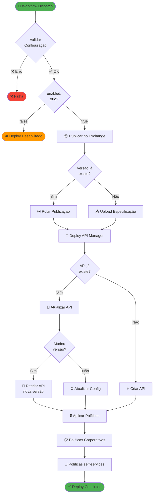

# 🚀 MuleSoft API Flex Gateway - Reusable Workflows

Pipeline reutilizável para deploy automatizado de APIs no MuleSoft Flex Gateway, incluindo publicação no Anypoint Exchange, deploy no API Manager e aplicação de políticas de segurança.


## 🎯 Visão Geral

Esta pipeline automatiza o processo completo de deploy de APIs no MuleSoft, incluindo:

- ✅ **Validação de configuração** da API
- 📦 **Publicação no Anypoint Exchange** (especificação OpenAPI)
- 🚀 **Deploy no API Manager** e Flex Gateway
- 🔒 **Aplicação de políticas de segurança** (corporativas + customizadas)
- 📊 **Configuração de alertas** por ambiente

**Por que usar?**
- Separa build de API do build de aplicação
- Controle de quando publicar no Exchange
- Políticas corporativas aplicadas automaticamente
- Configuração independente por ambiente
- Credenciais seguras via GitHub Secrets

---

## 🔄 Fluxo da Pipeline

### Fluxo Completo de Deploy


```mermaid
flowchart TD
    Start([🚀 Workflow Dispatch]) --> Validate{Validar<br/>Configuração}
    
    Validate -->|❌ Erro| End1([❌ Falha])
    Validate -->|✅ OK| CheckDeploy{enabled:<br/>true?}
    
    CheckDeploy -->|false| End2([⏭️ Deploy Desabilitado])
    CheckDeploy -->|true| Exchange[📦 Publicar no Exchange]
    
    Exchange --> CheckVersion{Versão já<br/>existe?}
    CheckVersion -->|Sim| SkipPublish[⏭️ Pular Publicação]
    CheckVersion -->|Não| Publish[📤 Upload Especificação]
    
    SkipPublish --> Deploy[🚀 Deploy API Manager]
    Publish --> Deploy
    
    Deploy --> CheckExists{API já<br/>existe?}
    CheckExists -->|Sim| Update[🔄 Atualizar API]
    CheckExists -->|Não| Create[✨ Criar API]
    
    Update --> CheckVersionChange{Mudou<br/>versão?}
    CheckVersionChange -->|Sim| Recreate[🔄 Recriar API<br/>nova versão]
    CheckVersionChange -->|Não| UpdateConfig[⚙️ Atualizar Config]
    
    Recreate --> Policies
    UpdateConfig --> Policies
    Create --> Policies
    
    Policies[🔒 Aplicar Políticas] --> Corporate[📋 Políticas Corporativas]
    Corporate --> Custom[🎨 Políticas self-services]
    
    Custom --> Success([✅ Deploy Concluído])
    
    style Start fill:#4CAF50
    style Success fill:#4CAF50
    style End1 fill:#f44336
    style End2 fill:#FF9800
```

## 📁 Estrutura do Repositório Consumidor

Estrutura mínima necessária:

```
seu-repositorio-api/
├── .github/
│   └── workflows/
│       └── deploy-api.yml          # Workflow que chama a pipeline reutilizável
├── api/
│   ├── api-config.yaml              # Configuração global da API
│   ├── dev.yaml                     # Configuração + políticas + SLAs do ambiente DEV
│   ├── hmg.yaml                     # Configuração + políticas + SLAs do ambiente HMG
│   ├── prod.yaml                    # Configuração + políticas + SLAs do ambiente PROD
│   └── swagger.json                 # Especificação OpenAPI (Pode ficar em qualquer parte do repositório)
└── src/                             # Código da sua aplicação
```

**Nota:** As políticas (self-services) e SLAs são definidos dentro de cada arquivo de ambiente (dev.yaml, hmg.yaml, prod.yaml). Politicas corporativas serão adicionadas automaticamente não serão sobresticas. Para visualizar as politicas que podem ser utilizadas, acesse aqui: 


## ⚙️ Configuração

### 1. Arquivo `api/api-config.yaml`

Configurações globais compartilhadas entre todos os ambientes:

```yaml
# ============================================================================
# CONFIGURAÇÃO GLOBAL DA API
# ============================================================================
# Este arquivo contém as configurações GLOBAIS compartilhadas entre todos os ambientes
# Configurações específicas de cada ambiente devem estar em dev.yaml, hmg.yaml, prod.yaml

# Informações Básicas da API
api:
  # Nome da API (será usado no Exchange e API Manager)
  name: "minha-api"
  # Sigla do projeto (usada para padronizar o path: /api/{acronym}/v1/{base-path})
  projectAcronym: "card"
  # Descrição da API
  description: "API de exemplo para demonstração do workflow de deploy"
  # Caminho do arquivo Swagger/OpenAPI (relativo à raiz do repositório)
  swaggerPath: "app/swagger.yaml"
  # Tipo de especificação: "oas" (OpenAPI/Swagger) ou "raml"
  specType: "oas"
  # Cluster de destino para o deploy
  # Valores: on-premise, aws-rosa, pix, pj
  destinationCluster: "aws-rosa"
  
  # API é pública (internet) ou privada (rede interna)?
  # true: Deploy no gateway DMZ com label "public" (apenas aws-rosa e on-premise)
  # false: Deploy no gateway BACK com label "private" (todos os clusters)
  isPublic: false
  
  # Tags para organização no Exchange
  # Adicione tags para facilitar a busca de suas APIs no catalog de APIs. 
  tags:
    - "backend"
    - "rest"
    - "flex-gateway"
    - "card-services"
  
  # Contato do time responsável
  contact:
    team: "Time de Exemplo"
    email: "backend@exemplo.com"

# Controle de Versão no Exchange
# IMPORTANTE: version.current é a versão que será PUBLICADA no Exchange
# Se a versão já existir no Exchange, a publicação será pulada (versões são imutáveis)
version:
  # Versão atual da especificação da API (SEMVER: major.minor.patch)
  # Incremente esta versão quando fizer mudanças na especificação
  current: "1.0.0"
  
  # Estratégia de versionamento no path exposto da API:
  # - "major": /api/card/v1/minha-api (recomendado)
  # - "major-minor": /api/card/v1_0/minha-api
  # - "full": /api/card/v1_0_0/minha-api
  # - "none": /api/card/minha-api
  pathStrategy: "major"

# ID da Organização no Anypoint Platform (mesmo para todos os ambientes)
# Obtenha em: Anypoint Platform → Access Management → Organization
organizationId: "YOUR_ORG_ID_HERE"

```

**Importante:** A versão em `version.current` é a que será publicada no Exchange. Se já existir, a publicação é pulada.

### 2. Arquivos de Ambiente (`dev.yaml`, `hmg.yaml`, `prod.yaml`, etc.)

Cada ambiente tem suas próprias configurações, políticas e SLAs:

```yaml
# ============================================================================
# CONFIGURAÇÃO DO AMBIENTE DE DESENVOLVIMENTO
# ============================================================================
# Este arquivo contém as configurações específicas para o ambiente DEV

# Configuração do Ambiente
environment:
  # ID do ambiente no Anypoint Platform
  environmentId: "DEV"
  
  # Versão específica para deployar neste ambiente
  # VAZIO ou não definido: usa version.current do api-config.yaml
  # "1.0.0": usa versão específica (útil para rollback ou testes)
  deployedVersion: ""

  # Configurações do Upstream (backend) - onde o Flex Gateway irá rotear as requisições
  upstream:
    # URL do backend
    # IMPORTANTE: Não inclua barra (/) no final da URL
    uri: "https://jsonplaceholder.typicode.com"
    
    # TLS Context ID de saída (usado quando o gateway conecta ao upstream via HTTPS)
    outboundTlsContextId: ""
    
    # ID do grupo de segredos de saída (obrigatório apenas se outboundTlsContextId configurado)
    outboundSecretGroupId: ""

  # Configurações do Gateway (listener - onde a API será exposta)
  gateway:
    # Protocolo (http ou https)
    schema: "https"
    # Porta
    port: 443
    
    # Base path da API exposta no gateway (será combinado com a estratégia de versionamento)
    # Exemplo com pathStrategy "major" e version 1.0.0: /api/crf/v1/minha-api
    basePath: "/minha-api"
    
    # TLS Context ID de entrada (obrigatório apenas se schema=https)
    inboundTlsContextId: ""
    # ID do grupo de segredos de entrada (obrigatório apenas se inboundTlsContextId configurado)
    inboundSecretGroupId: ""
  
  # Endpoint do consumidor (opcional - usado para documentação/referência)
  consumerEndpoint: "https://dev-api.exemplo.com"

# ============================================================================
# POLÍTICAS DA API - AMBIENTE DEV
# ============================================================================
# Políticas customizadas específicas desta API
# Formato: policyRef + config (padrão Mulesoft)

policies:
  inbound:
    # Exemplo: Header Injection
    - policyRef:
        name: "header-injection-flex"
        version: "1.2.0"
        groupId: "68ef9520-24e9-4cf2-b2f5-620025690913"
      config:
        inboundHeaders:
          - key: "X-Custom-Header"
            value: "my-value"
        outboundHeaders: []

  outbound:


```

**Nota:** Políticas corporativas obrigatórias são aplicadas automaticamente pela pipeline.

### 3. Secrets do GitHub

Configure no seu repositório:

| Secret | Descrição |
|--------|-----------|
| `ANYPOINT_CLIENT_ID` | Client ID da Connected App |
| `ANYPOINT_CLIENT_SECRET` | Client Secret da Connected App |

---

## 🚀 Como Usar

### 1. Criar Workflow no Repositório Consumidor

Crie `.github/workflows/deploy-api.yml`:

```yaml
name: Deploy API to Flex Gateway

on:
  workflow_dispatch:
    inputs:
      environment:
        description: 'Ambiente para deploy'
        required: true
        type: choice
        options:
          - dev
          - hmg
          - prod

jobs:
  deploy:
    uses: repo-owner/repo-pipeline/.github/workflows/reusable-api-deployment.yml@main
    with:
      environment: ${{ inputs.environment }}
    secrets:
      ANYPOINT_CLIENT_ID: ${{ secrets.ANYPOINT_CLIENT_ID }}
      ANYPOINT_CLIENT_SECRET: ${{ secrets.ANYPOINT_CLIENT_SECRET }}
```


---

### Quando Incrementar Versões

| Tipo de Mudança | Incremento | Exemplo |
|----------------|-----------|---------|
| **Breaking Change** (Remove endpoint, muda contrato) | MAJOR | `1.0.0` → `2.0.0` |
| **Nova Feature** (Adiciona endpoint) | MINOR | `1.0.0` → `1.1.0` |
| **Bug Fix** (Correção de documentação) | PATCH | `1.0.0` → `1.0.1` |

### Fluxo Recomendado

1. **Desenvolver** → `swagger.json` com versão `1.1.0`
2. **Publicar no Exchange** → Asset `1.1.0` criado (imutável)
3. **Deploy em DEV** → `deployedVersion: "1.1.0"` em `dev.yaml`
4. **Testar em DEV** → Validar nova versão
5. **Deploy em HMG** → `deployedVersion: "1.1.0"` em `hmg.yaml`
6. **Deploy em PROD** → `deployedVersion: "1.1.0"` em `prod.yaml`


---

## 📊 Outputs da Pipeline

| Output | Exemplo |
|--------|---------|
| `api-id` | `12345678` |
| `api-version` | `1.0.0` |
| `exposed-path` | `/api/card/v1/produtos` |

**Usar em workflows subsequentes:**

```yaml
jobs:
  deploy:
    uses: repo-owner/repo-pipeline/.github/workflows/reusable-api-deployment.yml@main
    # ... config

  test:
    needs: deploy
    runs-on: ubuntu-latest
    steps:
      - run: |
          curl https://gateway.empresa.com${{ needs.deploy.outputs.exposed-path }}/health
```

---

## 🎓 Links Úteis

- [MuleSoft Anypoint Docs](https://docs.mulesoft.com/)
- [Flex Gateway Docs](https://docs.mulesoft.com/gateway/)
- [OpenAPI Spec](https://swagger.io/specification/)

